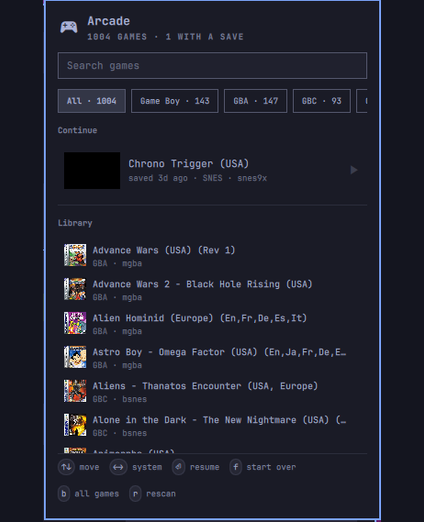
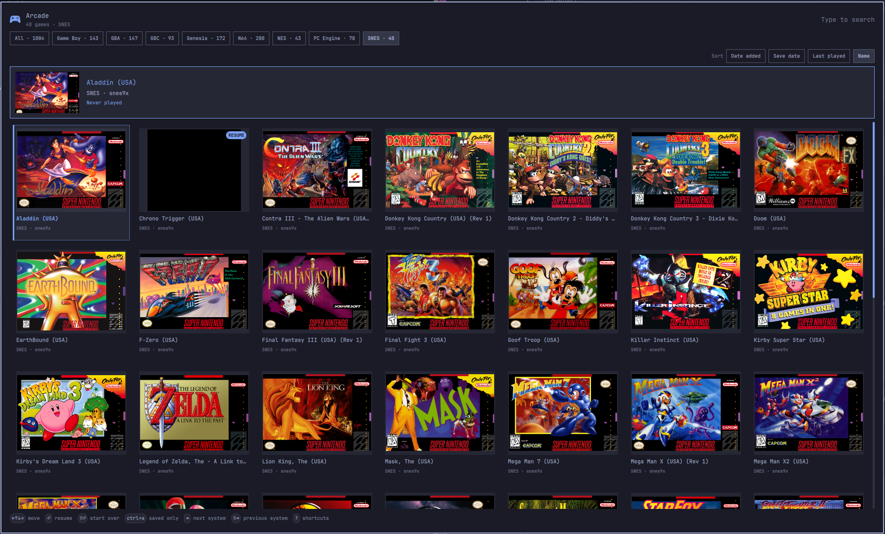

# Arcade

Arcade is an Omarchy plugin for browsing and launching your RetroArch library.
Use the bar panel to resume a recent save or open the full library as a
cover-art grid.

<p align="center">
  
</p>

<p align="center">
  
</p>

## Features

- Resume save states from their RetroArch screenshots, or start games fresh.
- Browse by system and sort by date added, save date, last played, or name.
- Search from either the bar panel or the fullscreen overlay.
- Use RetroArch playlists, installed cores, save states, and thumbnail art
  without duplicating your library.
- Track playtime and remember core choices.
- Follow the active Omarchy theme.

## Requirements

- Omarchy Quattro
- RetroArch with at least one installed libretro core
- Bash and `jq`, included with Omarchy

Arcade has no install hooks, bundled dependencies, network requests, or
privileged setup.

## Install

```bash
omarchy plugin add https://github.com/cgaray/omarchy-arcade.git --enable
```

Add `io.github.cgaray.arcade` to the bar from **Omarchy menu > Settings >
Bar**, or add it to `~/.config/omarchy/shell.json`:

```jsonc
{ "bar": { "layout": { "right": [ { "id": "io.github.cgaray.arcade" } ] } } }
```

### Prepare RetroArch

Arcade reads RetroArch playlists instead of scanning ROM directories. In
RetroArch, open **Import Content** and scan your ROM directory. See Libretro's
[scan and import guide](https://docs.libretro.com/guides/import-content/#step-2-scan-and-import).

To add cover art, open **Online Updater > Playlist Thumbnails Updater** and
select each imported system. See Libretro's
[thumbnail guide](https://docs.libretro.com/guides/roms-playlists-thumbnails/#thumbnails)
for details.

Press `r` in Arcade after RetroArch finishes.

## Use

Click the bar icon to open the panel. Press `b` from the panel, or right-click
the bar icon, to open the fullscreen library.

### Bar panel

| Key | Action |
|---|---|
| `Up` / `Down` | Move through the list |
| `Enter` | Resume the selected game, or start it if no save exists |
| `f` | Start the selected game fresh |
| `s` / `S` | Select the next or previous system |
| `/` | Search |
| `b` | Open the fullscreen library |
| `r` | Rescan the library |
| `Esc` | Clear search, then close the panel |

Left-clicking a game resumes it; right-clicking starts it fresh.
Middle-clicking the bar icon rescans the library.

### Fullscreen library

Use the arrow keys to move, `Enter` to resume, and `f` to start fresh. Start
typing to search. `Tab` and `Shift+Tab` change systems, `Ctrl+S` shows only
games with save states, and `?` lists every shortcut. Press `Esc` to close.

## Core selection

Arcade detects installed cores from RetroArch's `.info` files. When multiple
cores support the same ROM type, choose one in the **Cores** section at the
bottom of the bar panel. Choices are stored in
`~/.config/omarchy/arcade/cores.conf`.

Arcade chooses a core in this order:

1. The core assigned to the playlist entry.
2. The playlist's default core.
3. Your choice in `cores.conf`.
4. The first installed core that supports the ROM type.

Games without a usable installed core are omitted.

## Settings

Configure Arcade from the bar widget settings or in `shell.json`:

| Setting | Default | Purpose |
|---|---|---|
| `refreshIntervalSec` | 300 | Full rescan interval |
| `watchRoms` | true | Watch for library and save-state changes |
| `watchIntervalSec` | 10 | Change-check interval |
| `maxLibraryRows` | 40 | Maximum rows rendered in the bar panel |

Play history and first-seen dates are stored in
`~/.local/state/omarchy-arcade`. Arcade does not modify RetroArch's playlists,
ROMs, save states, or thumbnails.

## Remove

```bash
omarchy plugin remove io.github.cgaray.arcade
```

Play history and core choices are retained for future installations. Remove
them with:

```bash
rm -rf "$HOME/.local/state/omarchy-arcade" "$HOME/.config/omarchy/arcade"
```

## Tests

```bash
./tests/run.sh
```

## License

MIT
